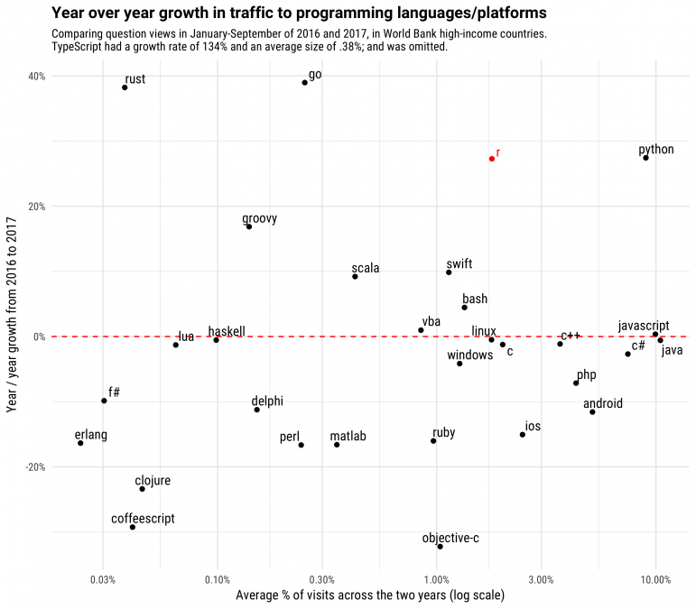
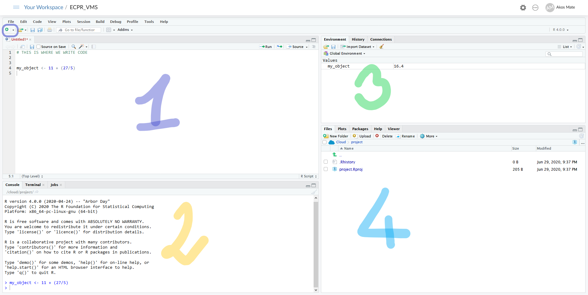
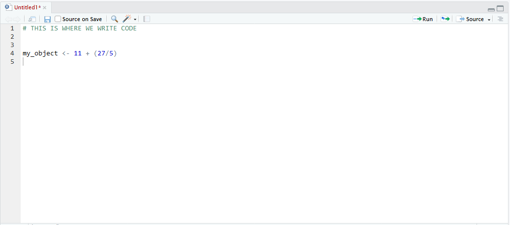
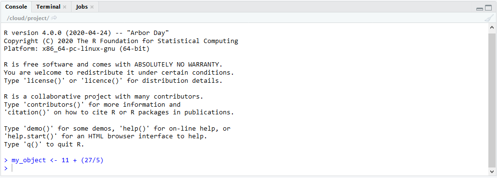
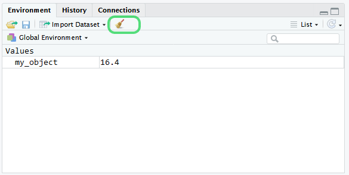
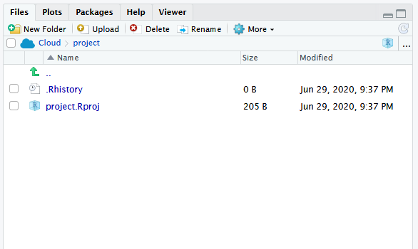
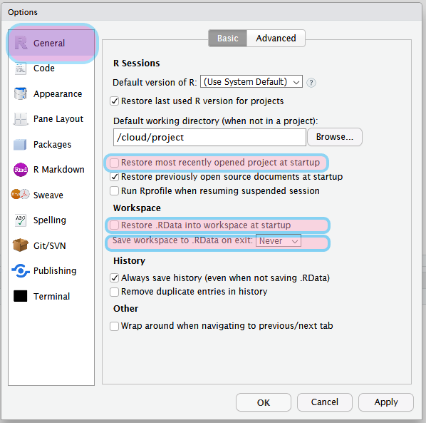
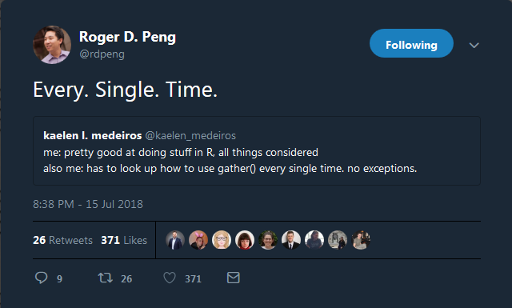
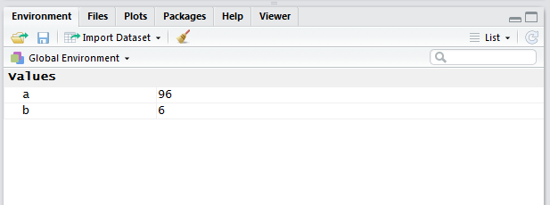

```{r setup, include=FALSE}
knitr::opts_chunk$set(echo = TRUE,
                      collapse = TRUE,
                      comment = "#>",
                      message = FALSE
)
```


# An overview

> **Contact info**
>
> - Akos: aakos.mate@gmail.com <br>
> - Daniel: Kovarek_Daniel@phd.ceu.edu


> **Course info and materials**
>
> - [https://ceulearning.ceu.edu/course/view.php?id=9930](https://ceulearning.ceu.edu/course/view.php?id=9930)


# Welcome the the Intro to R course!

Some information about these html documents. They are called notebooks, and they will provide the backbone of the course. They include explanatory text such as this, and R code and R code output. This combination allows you to see the code and the output and also have a detailed explanation for each section that you can come back to whenever needed.

At the start of each new section you'll see a list of the main packages used for the following parts, the main functions covered and also some additional materials, resources that you'll find helpful. 

There are some sections marketd (OPTIONAL), these ones I won't cover due to time limit, but you can check them out on your own and have a go at them.


## Why R?

- One of the most used statistical tools in academia and in industry
- It is open source, which means that the functions are not black boxes; when in doubt you can check what happens under the hood.
- Because it is open source, it is at the cutting-edge of implementing new methods.
- The R developer and user community is great in numbers and in resources. If you have a problem, chances are there is a package for that or an online discussion on how to solve it.
- Reproducible research, which means that your code will produce the exact same output, making it easier to replicate your results or verify your (or others’) methods.
- Statistical programming is a great transferable skill to have
- Free of charge

<br>
<br>

**Evidence 1:**

```{r out.width = "600px", echo=FALSE, fig.cap="",fig.align='center'}

```


<br>
<br>

**Evidence 2:**

```{r out.width = "600px", echo=FALSE, fig.cap="", fig.align='center'}
knitr::include_graphics("figures/r_users.png")
```


*Source: [https://stackoverflow.blog/2017/10/10/impressive-growth-r/](Stack Overflow blog)*


## Outline and goals of the training

The goals of this course:

- Hands on experience with R
- de-mistify coding, hopefully be a positive first impression
- Equip you with a solid knowledge base of R and its ecosystem
- Walk through from the basics to producing meaningful analysis
- Heavy emphasis on visualization
- Cover all the steps of the research workflow: data cleaning -> data wrangling -> exploratory analysis -> modelling -> reporting
- Preparing you on how to get into R more if you want to 


## Course outline

> - Monday 27 ꟷ Friday 31 July 2020
> - ~2 hours of live teaching per day

The course is organized into four blocks, each a logical unit. The actual topics that we are going to cover fit into 8 categories, so we have 2 sessions' lenght of time buffer (previous years' experience shows that the 8 sessions actually fill the allocated time).


- **Block 1 - Intro to R**

    -  **Session 1 - Intro to R and the basics**
        - General intro R (video content?)
        - Introduction to RStudio Cloud / RStudio IDE

    - **Session 2 - Importing, exporting and exploring data**
        - Importing data into R
        - Quickly exploring data

<br>


- **Block 2 - Working with data**

    - **Session 3 - Data wrangling part 1**
        - Introducing the tidyverse tools
        - Reshaping data


    - **Session 4 - Data wrangling part 2**
        - A deep dive into data tasks
        - Dealing with missing data

    - **Session 5 - Data visualization**
        - Using ggplot2 package

<br>

- **Block 3 - Down the rabbit hole**

    - **Session 6 - Writing functions and iterating in R**
        - Writing our own functions
        - The DRY (don't repear yourself) principle 

    - **Session 7 - Doing statistics in R**
        - Hypothesis testing
        - OLS regression
        - (optional sneak-peak at other techniques)

<br>

- **Block 4 - Writing with R**

    - **Session 8 - Introduction to RMarkdown**
        - Write your articles / dissertation in R


# Setting up R and RStudio Cloud

> Supplimentary resources: [RStudio IDE Cheat Sheet](https://www.rstudio.com/wp-content/uploads/2016/01/rstudio-IDE-cheatsheet.pdf)  

R comes with a pretty spartan GUI so we will work with the RStudio IDE (integrated development environment). In the first half of the course we will use **RStudio Cloud**, which a browser based option and let's us get into R very quickly. Late in the course you'll install RStudio on your computer and learn to set up projects and everything necessary to carry out your own research.

The reasons we start with RStudio Cloud are that:

- it works in your browser, 
- you don't need to install anything (some IT departments are pretty over the top when it comes to allowing people install software on their work laptops), 
- you can easily access the shared projects
- it looks 99% the same as the desktop version so you have to get familiar with the user interface once.

*For the course, the following terms are used interchangeably: RStudio Cloud, RStudio IDE, RStudio*

## The building blocks of Rstudio IDE

When you log into the RStudio Cloud and open a project in your workspace you will see something very similar to this figure:

```{r out.width = "600px", echo=FALSE, fig.align='center'}

```

There are 4 panes, each of which we should get familiar with.

### The Script

Pane 1. is our R script. When you open a brand new project you need to create a new script either by clicking on the top left corner the small dropdown menu (circled in the picture) or by clicking on the `File` menu item. If you don't want to leave your keyboard, the key combination is **`Ctrl + Shift + N`**.

```{r out.width = "600px", echo=FALSE, fig.align='center'}

```

The R Script is a file with a `.R` extension. It is essentially a text file that can be opened with any text editor. Don't forget to save regularly. This is where we write the R code and then execute it. You can run the current line (where your cursor sits) or multiple highlighted lines with **`Ctrl + Enter`**. In this particular case I have 2 lines of code in my unsaved script. Line 1 is a comment (comments in R start with **`#`**), so R will ignore it. Running the second (non-empty) line does the following:

1. performing a mathematical operation
2. saving the result to the memory,
3. and assigning it the name **`my_object`**


### The Console


```{r out.width = "600px", echo=FALSE, fig.align='center'}

```

Pane 2. is the Console. We can write code here and execute it (by pressing Enter). This is also where you see the output of your code. In our case the console shows the same line we wrote in our script. As a general rule of thumb that you should follow: **do not write code in the console.** The reasons for this is that the code you execute in the console are not saved, you cannot comfortably access it later. The code lives in the script.


### The Environment


```{r out.width = "600px", echo=FALSE, fig.align='center'}

```

Pane 3. is the Environment. This is where we see the objects we created. It essentially shows all the things we stashed in the memory of the computer to be accessed later. These memory items are called **objects**. Objects can be a wide variety of things (as we will see soon). In our example case we see the `my_object` and also that it has the value of 16.4.

With the little broom icon (circled in the above figure) you can empty your R memory. This is a handy little feature of RStudio. Next to it is the import data icon, but *I recommend that all steps that you do should be part of your code, including data import and export* so you can safely ignore this button.


### The Files, Plots and Help

```{r out.width = "600px", echo=FALSE, fig.align='center'}

```

The 4.th Pane shows multiple important things. Firstly, in the **Files** view you can see the contents of your current working directory. When we are working with projects this is the directory where your `.Rproj` file is located. In the **Plots** view we will see the output of our plotting efforts. RStudio automatically changes to the Plot output whenever we create a new plot. **Help** is where you see the output of the in application documentation for the functions.


## Using Projects

Hopefully this section is old news for you because you've already read the only compulsory reading we had: Jenny Brian's blogpost on Project-oriented workflow [Project-oriented workflow](https://www.tidyverse.org/blog/2017/12/workflow-vs-script/).

Using Projects with RStudio will simplify your and your collabolators' life. Essentially, **all your project related files are collected in your selected folder so you don't need to specify a working directory.** Your project will be able to run as long as you copy the entire folder.

For now, we are going to use RStudio Cloud projects for our first few sessions that I set up, so you can get the hang of it. Later on we'll get into setting up projects on your local computer. Before starting work, please set the highlighted options according the below figure, under **`Tools` -> `Global Options` -> `General`**

```{r out.width = "600px", echo=FALSE, fig.align='center'}

```


For more help and materials on using projects, see [RStudio's own resource page](https://support.rstudio.com/hc/en-us/articles/200526207-Using-Projects)


### Before we move on
Let's talk about keeping your R and other projects safe from tornadoes, toddlers, toasters or T-rexes. Ideally, your work lives on your (1) hard drive *AND* a (2) back-up hard drive (preferably an SSD) *AND* a (3) cloud service (such as Dropbox, Google Drive, MS OneDrive). I would recommend Dropbox as it seems to be the most robust out of these three. It also has file version history, so even if you accidentally delete something can get it back. 

> **General tips:**  
>
> - Check the [R coding style guide](http://style.tidyverse.org/index.html)  
> - Comment your codes heavily (with the `#`) because now seemingly straightforward code will not be so in the future (tomorrow morning)  
> - Use sensible file names (e.g.: `01_data_cleaning.R`)  
> - R is case sensitive, so use lowercase file and variable names. Separate words with underscore `_` (e.g.: `ols_reg_1`) (or you can do the camelCase thing, but be consistent)


## Getting help and citing R and packages

It is OK to get stuck in R and look for help. Don't worry if don't remember a function's name or arguments by heart, as with everything the more you write R, the more you can recall from memory. Programming (R included) requires great Google search skills (or DuckDuckGo, if you are not keen on Google) but just like drawing, math or sword forging for the Japanese emperor, it requires a great amount of practice and not some innate magical ability that only 5% of the living population is gifted by a benevolent coding deity. My advice: find your pet projects, find joy in R and coding, do not give up and use Google and StackOverflow without any hesitation.

To illustrate my point of not caring about knowing every function off the top of your head:

<br><br>

```{r out.width = "500px", echo=FALSE, fig.align='center'}



```
  
  
```{r out.width = "300px", echo=FALSE, fig.align='center'}


```    
 
<br>

Some effective ways to seek help with R related problems:

- Within R, you can just type `?function name` and you'll be shown the function help.
- Google “R” followed by the name of the package and/or a very short description of the problem. Like this: **“R ggplot bar chart”**
- Google “R” followed by the error message (or part of it) that R gives you. 
- In most of the cases one of the first hits will be a topic on [StackOverflow](https://stackoverflow.com/). You can use it to ask your own questions, BUT check if it is not a duplicate because there is a good chance that someone else already encountered the same problem that you are searching for.

**Since R is an open source project it is a common courtesy to cite R and the packages you use**, as people (often in academia) put many hours into developing tools and it is in our common interest to give some public recognition to these efforts and contributions. To see how to cite R or you can just type the following:

```{r}
citation()
```

You can cite a specific package with the following:
```{r}
citation("quanteda")
```


# First steps - Basic operations

> **Main packages used:** `base R`  
> **Main functions covered:** `help`, `c()`, `typeof()`, `lenght()`, `sum()`, `data.frame()`, `matrix()`, `list()`, `[`, `[[`  
> **Supplementary resources:** [Base R Cheat Sheet](https://www.rstudio.com/wp-content/uploads/2016/05/base-r.pdf)  

To get started:

- **Open the RStudio Project:** 
- **Start a new R script** by `Ctrl + Shift + N` (or from the top menus). 
- **Don't forget to save** the script to your project folder (`Ctrl + s`)! 

You can copy and paste code from this html document to your script and run it, but I recommend that you type everything as it allows for deeper learning experience. If you get stuck you can always check this document. Don't forget to **comment your code** with `#` (hashtag). Anything in the given line after `#` will not be taken into consideration when the code runs.


**NOTE:** This first part is tedious. I get it. I know. Unfortunately these knowledge building block are neccesary to cover before we get to the juicy parts so we speak the same language (pun sort of intended). Please bear with me during this session I know for some it is boring because you know this, for some it seems to make no sense (it will, I promise) and for some this seems overly technical (I tried to keep the bare minimum). With this caveat, let's start coding in R!


## Getting started

We can make R carry out basic calculations with the usual symbols: `+ - / *`. You can run the current line (don't need to select the code) with the `Ctrl + Enter` shortcut. 

```{r  }
16+80

```


R follows the order of operations of course. 
```{r}

4+4/2

(3-27+128)*16

```


In addition to carry out numerical operations, you can ask R to check if certain logical conditions are met, such as a value is greater or less or equal to another. It is essentially asking R the question of "is this value greater than that value?" to which we will receive an output of `FALSE` or `TRUE`.

```{r  }
5 > 4 # greater than

6 < 8

7 == 7 # equal with (two = sign)

10 >= 10 # greater or equal than

42 != 42 # not equal to
```

The conditions that you can use in R:

* `a == b` Are equal
* `a != b` Not equal
* `a > b` Greater than
* `a < b` Less than
* `a >= b` Greater than or equal to
* `a <= b` Less than or equal to
* `!x` Not x
* `x | y` x OR y
* `x & y` x AND y
* `is.na(a)` Is missing
* `is.null(a)` Is null

## Functions

Functions do the heavy lifting in R. They have the format below:

```{r eval=FALSE}

function(argument1 = value1, argument2 = value2, ...)

```

For example check the following code for computing a square root of 7 by hand and by using a built in `sqrt()` function of R.

```{r  }
# doing it by hand approach
7^0.5

# built in function
sqrt(7)
```


R comes with a variety of math functions if needed. Some examples are below. For the `log()` example, you can see that the first computes the natural logarithm. If you have something else in mind, you can specify it with the `base = ` argument.


```{r  }

log(10)

# you can specify the base if you want
log(10, base = 10)


# if you need to round, you can use the `round()` function and nest the other function in it. E.g.:
round(sin(5), 2)
```

If you are in doubt what are the arguments of the given function, you can use `?help(function_name)`, `?function_name` or more directly
```{r}
args(round)
```


## Data types, variables and data structures

R let's you save data into the memory by storing it in an object (it's just a fancy name for stored data basically). You can do it with an assign operator: `<-` (**shortcut: `Left Alt + -`**). The `=` sign also works but it is R coding practice to use `<-` to assign values to objects and use `=` within functions. Using the shortcut helps!

Let's create two objects, where we store the results of some calculations.
```{r}
a <- 16+80

b <- 4+4/2
```

Objects are essential part of the R workflow. You can see your current objects in the right pane named 'Environment'. 

<br>  

```{r out.width = "600px", echo=FALSE}

```

<br>  
<br>  

You can check (evaluate) your object by running it's name. Writing the name of your object is equivalent to printing it to your console.
```{r  }
a

print(b)

```

More importantly, we can perform all sorts of operations on our objects which will be the foundation of our workflow later on. This mean that we can have multiple datasets and objects containing all sorts of information (regression outputs, plots, etc.) in the memory.

```{r}
a/2

a*b
```


### Data frames

A data frame is a rectangular data structure, where usually each row is an observation and each column is a variable. With R the data frame is our primary workhorse, the majority of our data is stored in this format and most of our data cleaning efforts are centered on getting nice clean data frames at the end. It can contain multiple types of data but columns can only contain one type. Data frames are made up of various columns that can contain various types of data. The below data frame called `df` looks like this. Note the `<chr>`, `<dbl>` and `<fctr>` tags below their names! 


```{r echo=FALSE}
country <- c("Thailand", "Norway", "North Korea", "Canada", "Slovenia", "France", "Venezuela")
pop <- c(68.7, 5.2, 24, 47.8, 2, 63.6, 31.6)
continent <- factor(c("Asia", "Europe", "Asia", "North America", "Europe", "Europe", "South America"), levels = c("Asia", "Europe", "North America", "South America"))

df <- data.frame(country, pop, continent, stringsAsFactors = FALSE)
```


```{r}
df
```

To understand how each of these types works and how a data frame is constructed we will have to have a more in-depth look at each one. In R parlance, each column is a vector of a given data type.


### Vectors  

You can also combine values into a vector. To do this, we use the `c()` function. Below we will create numeric vectors with lenght of four. When you perform operations with vectors keep in mind that R matches the first element of the first vector to the first element of the second vector (called *element-wise execution*). This will result in a new vector with the same lenght as the originals. You can specify each element of the vector or give a range (e.g.: `c(1:4)`)

```{r  }
c(5, 10, 15, 20)

# operations with vectors
c(1:4) + c(10,20,30,40)
```


These vectors can have six types: *doubles*, *integers*, *characters*, *logicals*, *complex*, and *raw*. To check if we are indeed dealing with a vector, we can perform the `is.type` question, as below. We can also check its length, just in case. If you are not sure about the type you can skip the trial and error with the `typeof()` function. (we'll skip complex and raw, as they are so niche that you can just check in case you ever need those)

If you want to refer to a specific value in a vector, you must use square brackets after the name of the object: `[` and `[[`. The brackets contain the sequence number of the value you want to refer to. Such indexing can also be used to replace values in objects. **BEWARE** that R happily overwrites your objects without any warning or double checks and there is no undo button! It is best to create new objects if you plan to further tinker with them.

```{r}
num <- c(5, 10, 15, 20)

num[3]

```

Assigning a new value to the n-th element of our vector works with combining the assignment operator (`<-`) and the `[` indexing we just learned. 
```{r}
num[3] <- 42

num
```


#### Numerical

```{r  }
num <- c(5, 10, 15, 20)

length(num)

typeof(num)
```

R functions use the name "double" and "numerics" interchangeably (and so will I during the course). (doubles comes from computer science and refers to the number of bytes it takes to store a number) Numerics can be positive, negative, have digits or not, they are regular numbers. If you insist on having an integer vector you can specify it by adding an `L` after the numeric value. In most of the cases you will use numerics instead of integers and R defaults to numerics as well if you do not specify your needs. 

```{r}
int <- c(4L, 7L, 18L)


is.integer(int)

```

#### Character

For characters, you have to wrap the values between " " (or ' ') for R to recognize it as such.

```{r  }
# a vector with character (string) values, with a length of 3 and 1
text1 <- c("Han", "shot", "first") 

text2 <- c("Hello world")

typeof(text1)

length(text1)

length(text2)
```


You can also combine vectors into one with the `c()` function.

```{r}
text3 <- c(text1, text2, "this is", "R")

text3
```

> QUICK EXCERCISES: 
> 
> 1. Create a character vector, which would give the following result.

```{r echo=FALSE}
print(c("42", "4", "2"))
```


> 2. combine our previous numerical vector into one. You should see the same result as below (num and a and b). What happens if you try to mix the two type of vectors (num and text1)?

```{r echo=FALSE}
print(c(num, a, b))
```


#### Logical

You can store logical values in a vector as well. R assigns numerical values to them in some cases, where `TRUE` is 1, and `FALSE` is 0. See the below example.

```{r}
logic <- c(TRUE, FALSE, FALSE)

typeof(logic)

```

Store the result of a logical evaluation
```{r}
test <- text2 == "Hello world"

test
```

To count how many `TRUE` values we have, let's sum up the logic vector
```{r}
sum(logic)
```


This latter function comes handy if we want to know for example, how many values are above or below a certain treshold in our vector. We are going to use the `sum` function for this.

```{r}
num > 10

# let's sum the results
sum(num > 10)
```


#### Factors

Another common data type in R is factor variable where you assign discrete levels to your values. It is commonly used in survey responses or for other categorical data (eye color, gender, political party preference, etc.). we can create a factor variable with the `factor` function, where we can add the elements and specify the levels.

```{r}
party_pref <- c("social democrat", "social conservative", "liberal", "green", "green", "social conservative")

# transform our character vector to factor
party_pref <- factor(party_pref, levels = c("social democrat", "social conservative", "liberal", "green"))

party_pref

# if we want to set a given order, we can do that too.
survey_response <- factor(c("agree", "neutral", "disagree", "neutral", "disagree", "disagree", "agree"), 
                          levels = c("agree", "neutral", "disagree"), 
                          ordered = TRUE)

survey_response

```


#### Missing values
Missing values are denoted with `NA`. 

```{r}
v <- c(1,2.45, NA, 76, NA)

v
```
You can check if a value is missing with the `is.na` function. 

```{r}
is.na(v)

```

> QUICK EXCERCISE: Check how many non missing values we have in the object `v`, we just created. The correct solution should be the following output. (Hint: remember that logicals have numerical values!)

```{r echo=FALSE}
# short solution
sum(!is.na(v))

# long solution
# length(v) - sum(is.na(v))
```


### Matrices (OPTIONAL)

Data frames can contain diverse types of data like factors, numbers and logical values. A matrix is a similarly two-dimensional data object that can contain only one type of value.

Let’s create a matrix that contains three columns with 4 values each. You can create a matrix with the function matrix(), which requires at least the following arguments: a vector of values that make up the matrix, the number of rows, the number of columns.

```{r}
values1 <- c(1:20)
mat1 <- matrix(values1, nrow = 5, ncol = 4)

mat1
```

Matrices can also have row and column names like data frames.

```{r}
rownames(mat1) <- c("case1", "case2", "case3", "case4", "case5")

mat1


colnames(mat1) <- c("Var1", "Var2", "Var3", "Var4")

mat1
```


### Lists

Lists are versatile data structures where each element can be vectors of different lenght and type. What that means is that we can combine our objects that we created in this session into a list with the `list` function.

```{r}
list1 <- list(logic, mat1, text1)
# now let's check this monstrosity
list1
```


You can add attributes to lists as well. 

```{r}
list2 <- list(letters = letters[1:6], numbers = c(1:3), logical = c(TRUE, TRUE, FALSE, FALSE, TRUE))

attributes(list2)
```


You can check the attributes and also the structure of our list object with the `str()` function.

```{r}
str(list2)
```

You can access an item in your list by the single bracket operator `[ ]` or the double bracket operator `[[ ]]`.

Let's select the second item in our list2 with both methods and see what happens. What is the difference?

```{r collapse=FALSE, echo=FALSE}
# single bracket
list2[2]


# double bracket
list2[[2]]
```

The single bracket preserves the list format, while the double bracket simplifies our output to a vector. [Hadley Wickham's great illustration](https://r4ds.had.co.nz/vectors.html#lists-of-condiments) shows the difference more graphically.


### Coercion
You can change the type of data inside a vector. This is fairly straightforward and not used regularly. The most common use cases include the conversion of strings into some other data format (to numbers or dates)
From strings to numbers:
```{r}
string_numbers <- c("4", "5")

as.numeric(string_numbers)

```
From strings to dates (date is an actual data format in R):
```{r}
string_date <- "1999-01-31"

as.Date(string_date)

```


Coercing functions starts with `as.*`, where * marks the datatype. Start typing `as.` in RStudio and see how many functions are suggested with this beggining.


## Combining stuff into data frame
As promised before, we can weave all the vectors into one data frame. To do this, we use the `data.frame` function. First, we will create some vectors and then do the combination.

The following excercise is purely to illustrate how various types of columns make up a data.frame. In reality we rarely create data within R, but I find it a good excercise to see how such an object is created. So now we will create data for an imaginary classroom of 5 pupils with their names, grades and height. All three columns are different type of data.

```{r}
student <- c("Weber", "Hobbs", "Curie", "Lovelace", "Perlman")
grade <- factor(c("A", "C", "A", "B", "A"), levels = c("A", "B", "C"), ordered = TRUE)
height <- c(178, 165, 170, 190, 157)
```

Now combining the various vectors into one data frame, which we will call appropriately `pupils`.

```{r}
pupils <- data.frame(student, grade, height)

pupils
```


## Indexing intro

You can select individual rows and columns similarly as we did before with vectors. R uses the following logic: `data_frame[rows, columns]`. While this approach works for rectangular data (such as data frames and matrices) you can also refer to column by their names. For this, use the `$` sign. Remember: **rows by columns** is the order for indexing in R!

```{r}

# check the second row
pupils[2, ]

# check the first column
pupils[, 1]

```

Note that the `data.frame()` function creates factors from our character vector. If you want to avoid this (which is usually the case) by an additional argument telling R not to do that: `data.frame(country, pop, stringsAsFactors = FALSE)`

Access columns by their name. After the `$` sign, press tab and RStudio will give you a list of column in the data frame.

```{r}

pupils$Grade
```

What just happened?

Kind reminder: R is **case sensitive.** This is annoying at first, but you get used to it fast (as it is a common source of errors).

```{r}
pupils$grade
```

You can check the attributes of your object with the `attributes` function.

```{r}
attributes(pupils)
```
