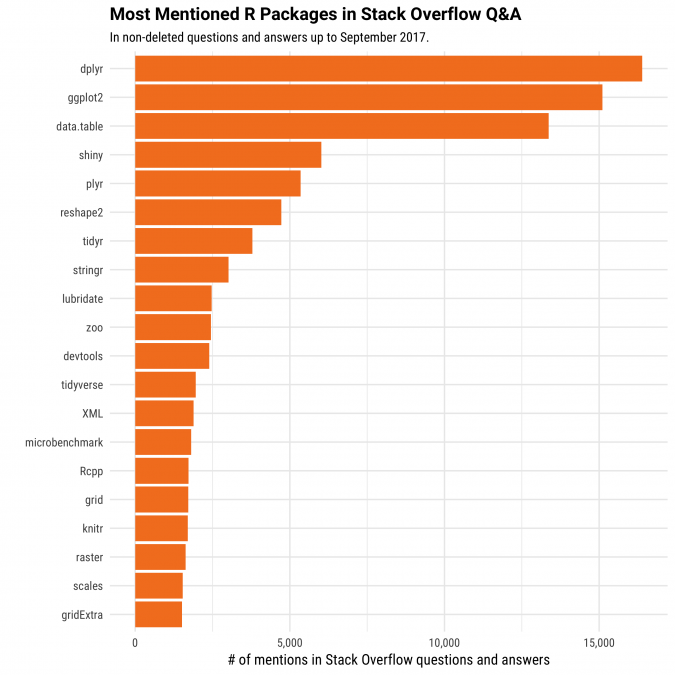

```{r setup, include=FALSE}
knitr::opts_chunk$set(
  echo = TRUE,
  collapse = TRUE,
  comment = "#>",
  message = FALSE,
  fig.align = "center"
)
```

> Main packages used: `haven`, `readxl`, `readr`
>
> Main functions covered: `readr::read_csv`, `readr::write_csv`, `readxl::read_excel`, `haven::read_stata` `haven::read_spss`

> **Supplementary resources:**
>
> -   [Data import cheat sheet](https://raw.githubusercontent.com/rstudio/cheatsheets/master/data-import.pdf)
> -   [R packages for statistical data sets](https://ikashnitsky.github.io/2017/data-acquisition-two/)

# Importing data into R

## Packages for importing data

We saw how we can create data within R, but most of the time you need to load your dataset into R to start the analysis.

At this point we want more than what `base R` can offer to us. Let's install and load some packages! **Packages are the cornerstone of the R ecosystem:** there are thousands of super useful packages (the most common repository for them is [CRAN](https://cran.r-project.org/)). Whenever you face a specific problem (that can be highly domain specific) there is a good chance that there is at least one package that offers a solution.

**An R package is a collection of functions that works much the same way as we saw earlier.** These functions and packages are written by R users and shared with the community. The focus and range of these packages are wide: from data cleaning, to data visualization, through ecological and environmental data analysis there is a package for everyone and everything. This ample supply might be intimidating first but this also means that there is a solution out there to a given problem.

To install a package from the CRAN repository we will use the `install.packages()` function. Note that it requires the package's name as a character.

```{r eval=FALSE}
# data import / export
install.packages("readr")
install.packages("haven")
install.packages("readxl")

# exploring data
install.packages("gapminder")
install.packages("dplyr")
install.packages("ggplot2")
```

After installing a given package we need to load it to be able to use its functions. We do this with the `library()` command. It is good practice to load all the packages at the beginning of the script.

```{r warning=FALSE, message=FALSE}
# data import / export
library(readr) # importing various data formats into R
library(haven) # importing data formats from other programs (Stata, SAS, SPSS)
library(readxl) # importing Excel tables into R

# exploring data
library(gapminder) # data we will use
library(dplyr) # data manipulation package
library(ggplot2) # data visulization package
```

**Important note:** whenever there is a conflicting function name (e.g: two packages have the same function name) you can specify what function you want to use with the `package::function` syntax. Below, when loading in the data, I use `readr::read_csv` to signify which package the function comes from.

We will look at the [Quality of Government basic data set](https://qog.pol.gu.se/data/datadownloads/qogbasicdata) and import it with different file extensions.

### Text (.csv)

First let's load the .csv file (stands for comma separated values). You can either load it from your project folder or directly from the GitHub repo. We are using the `readr` package that can read comma separated values with the `read_csv` function. It is a specific case of the `read_delim` function, where you can specify the character that is used as a delimiter (e.g.: in Europe comma is used as a decimal, so the delimiter is often a semicolon.)

It is possible to **load your data by downloading it using the url** of the data file and then the `read_csv` function will take care of the rest.

```{r, eval = FALSE}
qog_text <- readr::read_csv("http://www.qogdata.pol.gu.se/data/qog_bas_cs_jan20.csv")
```

If you have the data downloaded you can **load it from your project folder.** In the code below, I put the data file into the data folder within my project folder. (the path on a computer would look like this: `mydrive:/folder/project_folder/data`). The `"\data\file.csv` is called the relative path. When using projects we do not need to type out the whole path to the file, just its relative location to our main project folder.

```{r}

qog_text <- readr::read_delim("data/qog_bas_cs_jan20.csv", delim = ",")
```

With the `readr::read_csv` I specified that I use the function from that specific package. **The `package::function` is useful if there are conflicting functions in the loaded packages** or you want to make your package use explicit when functions have very similar names. In this case, `base R` also have a `read.csv` function, that is a bit slower than the one in `readr`.

### Excel (.xls and .xlsx)

Next we are loading the excel file. We use the `readxl` package's `read_excel` function to load the file (it does not support opening files via urls unfortunately).

```{r}
qog_excel <- readxl::read_excel("data/qog_bas_cs_jan20.xlsx")
```

### Stata (.dta) SPSS (.sav),

Importing data files from Stata 13+, SPSS, and SAS works similarly, using the `haven` package. If you have a data file that is not in these formats (or collaborators who work with weird software choices) you can check the `foreign` and `rio` packages. You also have some capability in `base R` but it is quite picky about software versions (check the `read.*` functions).

```{r}
# read the Stata .dta file
qog_stata <- haven::read_stata("data/qog_bas_cs_jan20.dta")

# read the SPSS .sav file
qog_spss <- haven::read_spss("data/qog_bas_cs_jan20.sav")
```

> QUICK EXCERCISE: read the help of the `read_excel` function and import in data to a new object where only the first 5 columns are imported.

The solution looks like this:

```{r echo=TRUE}
qog_ex <- read_excel("data/qog_bas_cs_jan20.xlsx", range = "A1:E195")

qog_ex
```

### Importing data from APIs (OPTIONAL)

There are loads of ways to load data to R via APIs, from various sources. This subsection builds on the excellent blogpost of [Data Acquisition in R](https://ikashnitsky.github.io/2017/data-acquisition-two/). We are not going into details (if you are interested, give the linked post a read!).

-   The `eurostat` package let's you import data from the...... Eurostat!

-   The `wbstats` is an API for World Bank data

-   The `OECD`package is providing the API for the OECD database

-   The `WID` package is for the World Wealth and Income Database. It is a bit trickier to download though than our trusted `install.packages()`. Since it is not up on the CRAN repository we need to directly download the package from their developers' github page, which contains the source code to it. The `devtools` package allows just that.

```{r, eval=FALSE}
install.packages("devtools")
devtools::install_github("WIDworld/wid-r-tool")
library(wid)
```

### Exporting data from R

Let's export our Quality of government data out of R. We can use the export function from the `readr` package: `readr::write_csv`. This will create a .csv file in our data/output sub-folder. Of course you can specify any other output directory.

```{r, eval=FALSE}
readr::write_csv(qog_text, path = "data/output/qog_export.csv")
```

Or we can use R's own compressed data format, the `.rds` which is more economical in hard disk space usage. However, if you intend to share your exported data, I'd recommend the .csv output.

The peculiarity of `saveRDS()` is that it can save any R object, not just a data frame, so if you want to reuse a given object later and do not want to spend computational time recreating it every time, you can save it as well. It will also save the file into your working directory.

```{r, eval=FALSE}
saveRDS(qog_text, file = "data/output/qog_rda.rds")
```

# Summarising and exploring data

> Main packages used: `base`, `ggplot2`, `dplyr`\
> Main functions covered: `head()`, `tail()`, `dplyr::glimpse()` `str()`, `summary()`, `table()`, `dplyr::group_by` and `summarise()`, `ggplot::ggplot()`\
> Supplementary resources: [ggplot2 cheat sheet](https://www.rstudio.com/wp-content/uploads/2015/03/ggplot2-cheatsheet.pdf)

## Overivew and summary statistics

We will use the `gapminder` package that contains macroeconomic data from the famous Hans Rosling presentation on life expectancy and income (as GDP).

```{r}
gapminder_df <- gapminder
```

If the data sets are small enough (couple of thousand rows, and few dozen variables) you can check them in RStudio's data viewer (or with the `View()` function). However, if you have a bigger dataset or smaller memory, it can be problematic. The quickest way to check if your data loads properly is the `head()` function. It shows you the first few rows and columns. `tail()` shows you the end of the data set.

```{r collapse=FALSE}
head(gapminder_df)


# let's check the end of our data
tail(gapminder_df)
```

If you are interested only a certain number of observations and columns, you can specify that as well with the `head` function or by indexing your data frame.

```{r}
head(gapminder_df, n = 3)
```

or check the 1:3 rows of the first four variables.

```{r}
head(gapminder_df[1:3, 1:4])
```

If you want to have a quick overview of your data, both `str()` and `dplyr::glimpse` are helpful.

```{r}
str(gapminder_df)
```

Both the `str` and `glimpse` function print out parts of your data set, the main differences between them and the head is they give you a complete look at your list of variables and their types.

```{r}
dplyr::glimpse(gapminder_df)
```

You can use `str()` on any object to see its structure (we'll come back to this later).

Now that we know we imported our data properly and have some sense of its dimensions (check what the `dim()` function does!) let's have a more in depth look!

For starters, use `summary()` to check some basic descriptives of our variables.

```{r}
summary(gapminder_df)
```

For the categorical variables you can use `table()` which generates a frequency table.

```{r}
table(gapminder_df$continent)
```

## Using the "tidyverse"

Now we dip into the `tidyverse` with the `dplyr` package.

> Disclaimer: I will emphasise `tidyverse` throughout the course, since it is one of the most useful meta-package: a collection of packages that helps to develop consistent workflow from data import to data cleaning to analysis. We will spend more time on this during the coming sessions. The tidyverse packages are a great stepping stone into R and later on for more complex problems you can turn to tools that are outside of these packages.

```{r, out.width = "600px", echo=FALSE}

```

[https://stackoverflow.blog/2017/10/10/impressive-growth-r/](*Source:%20Stack%20Overflow%20blog*)

### The pipe operator

One key advantage of the `tidyverse` packages is their compatibility with the use of the pipe operator: `%>%` (shortcut: **`Ctrl + Shift + M`**). It combines code and makes it more intuitive to work with data. Think of the `%>%` as a "then". This is just a short intro, so don't worry if this might be confusing. We will be using `dplyr` and other `tidyverse` packages a lot so you'll have enough time to get comfortable. For every "tidy" function and solution, there exists a base R or other package so if you find something unintuitive or problematic, you can have alternative solutions if you search for it.

**The `%>%` essentially pipes the data on it's left as the first argument for function after it.**

```{r, fig.cap="Intuition behind the pipe. (thanks to Andrew Heiss, https://twitter.com/andrewheiss/status/1359583543509348356", out.width = "600px", echo=FALSE}
knitr::include_graphics("figures/aheiss_pipe.jpg")
```

#### The powerful split-apply-combine approach

In our first step, we

1.**group our data by continent** and then 2. **create a summary variable**, that tells us the mean GDP for each continent.

```{r echo=FALSE, fig.cap="source: VanderPlas, Jake. Python data science handbook: Essential tools for working with data. (ch3)", out.width = "600px"}

knitr::include_graphics("figures/split-apply-combine.png")
```

Check the code snippet below to see the role of each line.

```{r}
# let's see the GDP by continents
gdp_cont <- gapminder_df %>% # we will use the gapminder data
  dplyr::group_by(continent) %>% # then group the data by continent
  dplyr::summarise(mean_gdp = mean(gdpPercap), n_obs = n()) # then create a `mean_gdp` variable where we compute the mean of the grouped gdpPercap variable.

# let's see the result.
gdp_cont
```

> QUICK EXCERCISE: combine the two approach and check the average, minimum, and maximum (hint: use the `mean`, `max()` and `min()` functions) life expectancy by continent. Your result should be like the one below.

solution should look like this:

```{r echo=TRUE}
gapminder_df %>%
  group_by(continent) %>%
  summarise(n = n(), mean = mean(lifeExp), maximum = max(lifeExp), minimum = min(lifeExp))
```

## Exploration by visualization

Using data visualization is a great way to get acquainted with your data and sometimes it makes more sense than looking at large tables. In this section we get into the `ggplot2` package which we'll use throughout the class. It is the cutting edge of R's data visualization toolkit (not just in academia, but in business and data journalism as well).

### Introduction to `ggplot2`

We will spend most of our time using `ggplot2` for visualizing in the class and I would personally encourage the course participants to stick to `ggplot2`. If for some reason you would like a non ggplot way of plotting in R, there is a section on base R plotting at the end of this notebook.

The name stands for *grammar of graphics* and it enables you to build your plot layer by layer and having the ability to control every detail of the output (if you so wish). It is used by many in academia and in industry, including Uber, StackOverflow, AirBnB, the Financial Times, BBC and FiveThirtyEight, among others.

To have some idea about our variables, lets plot them on a histogram. First, we examine the GDP per capita variable from our gapminder dataset. To this, we just use the `geom_histogram()` function of `ggplot2`. It gives a bare-bones histogram of the (frequency distribution of our chosen continuous variable) of the chosen variable.

Let's create the foundation of our plot by specifying for `ggplot` the data we use and the variable we want to plot.

```{r}
ggplot(
  data = gapminder_df,
  mapping = aes(x = gdpPercap)
)
```

We need to specify what sort of shape we want our data to be displayed. We can do this by adding the `geom_histogram()` function with a `+`

```{r}
ggplot(
  data = gapminder_df,
  mapping = aes(x = gdpPercap)
) +
  geom_histogram()
```

Looks a little bit skewed. Let's log transform our variable with the `scale_x_log10()` function.

```{r, message=TRUE}
ggplot(
  data = gapminder_df,
  mapping = aes(x = gdpPercap)
) +
  geom_histogram() +
  scale_x_log10()
```

As the message says, we can mess around with the binwidth argument, so let's do that.

```{r}
ggplot(
  data = gapminder_df,
  mapping = aes(x = gdpPercap)
) +
  geom_histogram(binwidth = 0.05) +
  scale_x_log10()
```

Of course if one prefers a boxplot, that is possible as well. We will check how life expectancy varies between and within continents. We'll use `geom_boxplot()`. In this approach, we create an object for our plot. You don't need to do this (there are instances where it is useful), but this shows you that just about everything can be an object in R

```{r}
p_box <- ggplot(
  data = gapminder_df,
  mapping = aes(
    x = continent,
    y = lifeExp
  )
) +
  geom_boxplot()

p_box
```

Interpretation of the box plot is that the following. The box contains 50% of the values, the whiskers are the minimum and maximum values without the outliers, the line inside the box is the median. The upper and lower edges of the box are the first and third quartiles, respectively.

In visual form:

```{r, out.width = "700px", echo=FALSE}
knitr::include_graphics("figures/EDA-boxplot.png")
```

*Source: [Wickham, Hadley, and Garrett Grolemund. R for data science: import, tidy, transform, visualize, and model data. " O'Reilly Media, Inc.", 2016.](http://r4ds.had.co.nz/exploratory-data-analysis.html)*

Let's use the gapminder dataset we have loaded and investigate the life expectancy and gdp per capita variables. We'll use the `geom_point()` function.

```{r}
ggplot(data = gapminder_df, mapping = aes(x = gdpPercap, y = lifeExp)) +
  geom_point()
```

Let's refine this plot slightly:

1.  add labels with `labs()`
2.  title,
3.  caption,
4.  transform the GDP variable with `scale_x_log10()`
5.  (plus some other minor cosmetics)

Check the comments in the code snippet to see what each line does!

```{r}
ggplot(data = gapminder_df, mapping = aes(x = gdpPercap, y = lifeExp)) +
  geom_point(alpha = 0.25) + # inside the geom_ we can modify its attributes. Here we set the transparency levels of the points
  scale_x_log10() + # rescale our x axis
  labs(
    x = "GDP per capita", # add captions and axis titles
    y = "Life expectancy",
    title = "Connection between GDP and Life expectancy",
    subtitle = "Points are country-years",
    caption = "Source: Gapminder"
  )
```

So far so good. With some minor additions the plot looks all right. But what if we want to see how each continent fares in this relationship? We need to change the `p1` object to include a new argument in the mapping function: `color = variable`. Now it is clear that European countries (country-years) are clustered in the high-GDP/high life longevity upper right corner.

```{r}
ggplot(data = gapminder_df, mapping = aes(x = gdpPercap, y = lifeExp, color = continent)) + # this is where we specify that we want to color the data by continents.
  geom_point(alpha = 0.75) +
  scale_x_log10() + # rescale our x axis
  labs(
    x = "GDP per capita (log $)",
    y = "Life expectancy",
    title = "Connection between GDP and Life expectancy",
    subtitle = "Points are country-years",
    caption = "Source: Gapminder dataset"
  )
```

When we are done with our nice figure, we can save it as well. I'd suggest to always save with code, and never from the "plots" pane on the right.

```{r eval=FALSE}
ggsave("gapminder_scatter.png", dpi = 600)
```

We can see how life expectancy changed in Mexico, Afghanistan, Sudan and Slovenia by using the `geom_line()` geom. For this, we create a new dataset by subsetting the gapminder one. The `%in%` operator does the same thing as the `==` but for multiple values. For subsetting we use the `dplyr::filter()` function. Don't worry if this sounds too much, we will spend a whole session on how to subset and clean our data.

```{r}
# subset the dataset to have our selected countries.
comp_df <- gapminder_df %>%
  filter(country %in% c("Mexico", "Afghanistan", "Sudan", "Slovenia"))

# create the ggplot object with the data and mapping info
ggplot(data = comp_df, mapping = aes(x = year, y = lifeExp, color = country)) +
  geom_line(aes(group = country)) # we need to tell ggplot that we want to group our lines by countries
```

`ggplot2` makes it easy to create individual subplots for each category by "faceting" our data. Let's plot the growth in life expectancy over time on each continent. We use the `geom_line()` function to draw a line and we tell ggplot to facet by adding the `facet_wrap(~ variable)` function.

```{r}
ggplot(data = gapminder_df, mapping = aes(x = year, y = lifeExp)) +
  geom_line(aes(group = country)) + # we need to tell ggplot that we want to group our lines by countries
  facet_wrap(~continent) # create a small graph for each continent
```

### The base R toolkit (OPTIONAL)

To have some idea about our variables, lets plot them on a histogram. First, we examine the GDP per capita variable from our `gapminder` dataset. TO this, we just use the `hist()` function. It gives a bare-bones plot of the histogram (frequency distribution of our choosen continous variable)

```{r}
# histogram indicates that our data is not normally distributed.
hist(gapminder_df$gdpPercap)

# maybe transforming it would help
hist(log(gapminder_df$gdpPercap))
```

If the plot is shared with some collaborators, maybe some formatting could help. We can change the the 'breaks' to have a more granular view of our data. To turn off scientific notation, let's use the `options(scipen=5)`.

```{r}
hist(gapminder_df$gdpPercap, breaks = 30)
```

```{r}
options(scipen = 5)

# you can also control the breakpoints beyond giving it a simple value.
hist(gapminder_df$gdpPercap, breaks = seq(0, 120000, 1500))
```

```{r echo=FALSE}
hist(gapminder_df$lifeExp,
  breaks = seq(20, 90, 5),
  ylim = c(0, 350),
  main = "Distribution of life expectancy",
  xlab = "Years"
)
```

For categorical variable, we should use a barplot. To see how many observation we have for each continent, let's use the `barplot`. We can use the `table()` function to see how many observations there are in each category and then plot that object.

```{r}
cont_table <- table(gapminder_df$continent)

barplot(cont_table, main = "Number of observations by continents")
```

For continuous data, we can use the generic `plot()` function.

```{r}
# to check how life expectancy changed in Mexico, we can subset our dataset and then plot the result. More on subsetting tomorrow!

mexico <- subset(gapminder_df, country == "Mexico")

# the first argument of the plot is the x axis, second is the y axis.
plot(mexico$year, mexico$lifeExp)
```

Something is not quite right...

```{r}
# check how we can change the dots to a line.
# ?plot

# We should add `type`. Also we can structure our function to be a bit more readable.

plot(mexico$year, mexico$lifeExp,
  xlab = "Year",
  ylab = "Life expectancy (Years)",
  col = "orange",
  type = "l"
)
```

```{r}
plot(log(gapminder_df$gdpPercap),
  gapminder_df$lifeExp,
  xlab = "Log GDP per capita",
  ylab = "Life expectancy",
  main = "Relationship between GDP and life expectancy",
  type = "p"
)
```

To see how each variable is associated with the other, we can use the `pair()` function. It will create a scatter plot matrix, where the variable name is on the diagonal. In the rows the vertical axis is the variable indicated in the diagonal and in the columns the horizontal axis is the variable indicated in the diagonal.

```{r}
pairs(gapminder_df[, c("lifeExp", "pop", "gdpPercap")])
```

We can make the plots a little nicer, by adjusting the points. (this can be done for the previous scatterplots as well!). `pch = 19` selects a point type which is filled, then with `col = rgb()` we can specify the exact color that we are looking for. The `alpha` argument regulates the transparency of the points.

```{r, out.width = "400px", echo=FALSE}
knitr::include_graphics("figures/pch-values.png")
```

*source: <http://kktg.net/sgr/wp-content/uploads/2014/02/fig-15-3-pch-values.png>*

```{r}
pairs(
  gapminder_df[, c("lifeExp", "pop", "gdpPercap")],
  pch = 19,
  col = rgb(0, 0, 0, alpha = 0.1)
)
```

The formula for the boxplot is instructing R to create a boxplot for each continent for the numerical variable of lifeExp. In general term, the formula is `y ~ group`.

```{r}
boxplot(lifeExp ~ continent,
  data = gapminder_df,
  main = "Distribution of life expectancy by continent",
  xlab = "Continents",
  ylab = "Life expectancy"
)
```

We can also do a grouped bar plot. For this we will use the star wars dataset and do a grouped bar plot of the eye color and gender in star wars movies. The logic is the same as for the barplot with a single variable, but now we add two for the `table()` function. We also add a legend to our plot with the `legend()` function.

```{r}
# grouped bar plot

# load the data
sw <- starwars


# create the table with the two variables of interest
sw_table <- table(sw$gender, sw$eye_color)

sw_table


# plot the grouped barplot. Mind the `beside` argument! We can also add a legend, so the colors are straightforward.
barplot(sw_table,
  beside = TRUE,
  col = c("orange", "brown", "green", "black")
)
legend(
  x = "topright",
  legend = c("Female", "Hermaphrodite", "Male", "None"),
  fill = c("orange", "brown", "green", "black"),
  cex = 0.7
)
```

If you want to have the proportional numbers, we can use the `prop.table()` function. If we use the sw_table table as the only argument, the we will get proportions of the total. If we use 1 as the second argument, we get proportions of rows and if we use 2, we get proportions of columns. Remember, rows come first and columns second!
