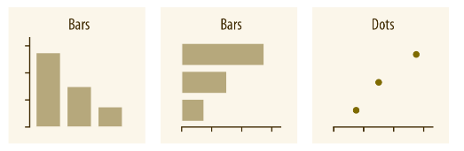
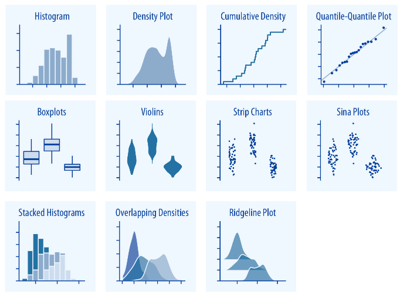
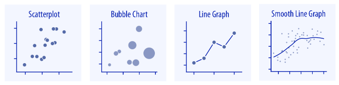

```{r setup, include=FALSE}
options(width=90)
knitr::opts_chunk$set(
  echo = TRUE,
  collapse = TRUE,
  comment = "#>",
  message = FALSE,
  fig.align = "center",
  tidy="styler", 
  tidy.opts=list(width.cutoff=80)
)
```


# Data visualization principles[^cwilke]

[^cwilke]: This short section builds heavily on the Part II. of Claus Wilke's brilliant [Fundamentals of Data Visualization](https://clauswilke.com/dataviz/)

> **The principle of proportional ink:** The sizes of shaded areas in a visualization need to be proportional to the data values they represent.

- Linear scale should always start at 0. 
- Color needs to be applied to serve a purpose, it must be clear, and it must not distract.
- Consider accessibility, keep your audience in mind.
- Consider redundant coding: it prompts us to encode data redundantly, using multiple different aesthetic dimensions.
- For large datasets, consider applying small multiples.
- Label chart elements properly and informatively
- Pay attention to your axis labels, axis tick labels, and other assorted plot annotations.
- Avoid line drawings
- ABSOLUTELY NO 3D (PIE) CHARTS.


```{r, out.width = "350px", echo=FALSE}
knitr::include_graphics("figures/data-ink.gif")
```

*source: [Darkhorse Analytics](https://www.darkhorseanalytics.com/blog/data-looks-better-naked)*


> **Supplementary resources:**
>
> - [ggplot2: elegant graphics for data analysis](https://ggplot2-book.org) From Hadley Wickham, Danielle Navarro, and Thomas Lin Pedersen.
> - [Data Visualization - A practical introduction](http://socviz.co/) from Kieran Healey.
> - [Fundamentals of Data Visualization](https://serialmentor.com/dataviz/) by Claus O. Wilke
> - [R Graphics Cookbook](https://r-graphics.org/) by Winston Chang
> - [ggplot2 cheat sheet](https://raw.githubusercontent.com/rstudio/cheatsheets/master/data-visualization-2.1.pdf)
> - [list of ggplot2 extensions](https://www.ggplot2-exts.org/)
> - [The R Graph Gallery](https://www.r-graph-gallery.com/)


First things first, let's load our packages.
```{r message=FALSE, warning=FALSE}
# loading and shaping data
library(readr)
library(dplyr)
library(haven)

# data sources
library(gapminder)
library(palmerpenguins)

# general data visualisation
library(ggplot2)
library(ggridges)
library(ggthemes)
library(gghighlight)
library(ggforce)
```


Let's also load our data that we'll be using this session. (don't worry about the message about the duplicated column names for now)
```{r warning=FALSE, message=FALSE}
# data
penguins_df <- palmerpenguins::penguins

gapminder_df <- gapminder

ess_hun <- read_csv("data/ESS_Hun_7.csv")

oecd_sum <- read_csv("data/oecd_sum.csv")

stocks <- read_csv("data/stocks.csv")
```


The name of `ggplot` stands for *grammar of graphics* and it enables you to build your plot layer by layer and having the ability to control every detail of the output  (if you so wish). It is used by many in academia, data journalism and the data analysis / data science industry[^ft]. We will go through various types of data visualizations and try to apply the above set of principles to our output.

[^ft]: In data journalism, the [Financial Times](https://johnburnmurdoch.github.io/slides/r-ggplot/#/), [BBC](https://medium.com/bbc-visual-and-data-journalism/how-the-bbc-visual-and-data-journalism-team-works-with-graphics-in-r-ed0b35693535) are the most famous ggplot2 users. In the industry, Airbnb, Uber are also prominent users.

You create plots with the below syntax:  

```{r, out.width = "300px", echo=FALSE}
knitr::include_graphics("figures/ggplot_formula.png")
```

This can be a little bit overwhelming but worry not as when by the time the session ends you'll be familiar with each element in this general description of a `ggplot2` plot.

## The logic of a ggplot2 plot
To kickstart this session, let's review how a plot is made and extend our knowledge on how to fine tune elements of the plot. This section was inspired by the great RLadies [presentation of Eva Maerey](https://evamaerey.github.io/ggplot_flipbook/ggplot_flipbook_xaringan.html#1) We will use the **Palmerson Penguins dataset**, that contains data for `r nrow(penguins_df)`  penguins. There are `r length(unique(penguins_df$species))` different species of penguins in this dataset, collected from 3 islands in the Palmer Archipelago, Antarctica. The original publication of this data is in [Gorman, Williams & Fraser (2014)](https://journals.plos.org/plosone/article?id=10.1371/journal.pone.0090081).


```{r out.width = "350px", echo=FALSE, fig.align='center'}

knitr::include_graphics("figures/02_penguins.png")

```  
Artwork by [allison_horst](https://twitter.com/allison_horst)

Now let's build a `ggplot2` plot from the grounds up!

### 1 {-}

First, we **specify the data** we want to use within our `ggplot()` function call with the `data = ` argument. 
```{r}
ggplot(data = penguins_df)
```


### 2 {-}

Second, we **decide on the dimensions of our data**. Let's start by specifying what to plot on the y and x axes. This is done within the `aes()` argument, which stands for 'aesthetic'.
```{r}
ggplot(data = penguins_df,
       mapping = aes(x = body_mass_g,
                     y = flipper_length_mm))
  
```


### 3 {-}

Third, we **add our wanted representation** of the data, with the `geom_` function family. 
```{r}
ggplot(data = penguins_df,
       mapping = aes(x = body_mass_g,
                     y = flipper_length_mm)) +
  geom_point()
```


### 4 {-}

Fourth, we can **add further dimension** to our plot by extending the `aes()` arguments. Let's add colors based on the species variable.
```{r}
ggplot(data = penguins_df,
       mapping = aes(x = body_mass_g,
                     y = flipper_length_mm,
                     color = species)) +
  geom_point()
```

### 5 {-}

Fifth, each **aesthetic can be rescaled**. Now we want to rescale our colors. We will use the manual color scale to specify each value. Colors can be added as HEX code, or names.
```{r}
ggplot(data = penguins_df,
       mapping = aes(x = body_mass_g,
                     y = flipper_length_mm,
                     color = species)) +
  geom_point() +
  scale_color_manual(values = c("#7fc97f", "blue", "#fdc086"))
```


### 6 {-}

Sixth, we can modify the **textual elements** of our plot. To do this, we can assign a string to every text element with the `labs` function. As we see the color aesthetic created automatically a legend on the side. We can remove the title of it should we want it.
```{r}
ggplot(data = penguins_df,
       mapping = aes(x = body_mass_g,
                     y = flipper_length_mm,
                     color = species)) +
  geom_point() +
  scale_color_manual(values = c("#7fc97f", "blue", "#fdc086")) +
  labs(
    title = "Penguins, their mass and their flippers",
    subtitle = "The positive relationship between body mass and flipper size",
    caption = "Data: Gorman, Williams & Fraser (2014)",
    x = "Body mass (g)",
    y = "Flipper length (mm)",
    color = ""
    )

```


### 7 {-}

Finally, we decide on the **theme** of our hearts. `ggplot2` offers an ocean of customization options for our plot, there are some pre-made themes but we can create our own as well. Now we will stick to `theme_minimal()`.
```{r}
ggplot(data = penguins_df,
       mapping = aes(x = body_mass_g,
                     y = flipper_length_mm,
                     color = species)) +
  geom_point() +
  scale_color_manual(values = c("#7fc97f", "blue", "#fdc086")) +
 labs(
   title = "Penguins, their mass and their flippers",
   subtitle = "The positive relationship between body mass and flipper size",
   caption = "Data: Gorman, Williams & Fraser (2014)",
   x = "Body mass (g)",
   y = "Flipper length (mm)",
   color = ""
   ) +
  theme_minimal()
```


## Data visualization staples

In this section we will cover various key types of visualizations. The structure of this section follows the structure of Claus Wilke's great [Fundamentals of Data Visualization](https://clauswilke.com/dataviz/) book. Here we will cover the most often used type of plots, how to make them and how to address/avoid some of the typical issues.

### Amounts and proportions

```{r out.width = "550px", echo=FALSE, fig.align='center'}



```  
Source: [Fundamentals of Data Visualization, 5.1 ch](https://clauswilke.com/dataviz/directory-of-visualizations.html#amounts)


#### Bars {-}

We can use the bar charts to visualize categorical data. Let's prep some data. We convert the character variables to factors, because this will let the `ggplot` function know the ordering of our categorical variables. If we want to order our variables according to a particular order, re-leveling the factors are the solution for that.

```{r}
ess_hun <- ess_hun %>% 
  mutate(
    gndr = factor(gndr, labels = c("Female", "Male")),
    polintr = factor(polintr, labels = c("Very interested", "Quite interested", "Hardly interested", "Not at all interested", "Refusal", "Don't know"), ordered  = TRUE)
  )

```


There are two ways to create a barcharts with `ggplot2`: `geom_bar()` and `geom_col()`. The difference between these two is well described by the `ggplot2` [documentation](https://ggplot2.tidyverse.org/reference/geom_bar.html): "`geom_bar()` makes the height of the bar proportional to the number of cases in each group (or if the weight aesthetic is supplied, the sum of the weights). If you want the heights of the bars to represent values in the data, use `geom_col()` instead. `geom_bar()` uses `stat_count()` by default: it counts the number of cases at each x position. `geom_col()` uses `stat_identity()`: it leaves the data as is."

We will be using `geom_bar()` for this section. Let's see the political interest of the Hungarian people.

```{r}
ggplot(ess_hun, aes(polintr)) +
  geom_bar()
```

We can use the `fill` option to map another variable onto our plot. Let's see how these categories are further divided by the gender of the respondents. By default we get a stacked bar chart.

```{r}
ggplot(ess_hun, aes(polintr, fill = gndr)) +
  geom_bar()
```

we can use the `position` function in the `geom_bar` to change this. Another neat trick to make our graph more readable is `coord_flip`.
```{r}
ggplot(ess_hun, aes(polintr, fill = gndr)) +
  geom_bar(position = "dodge") +
  coord_flip()
```

Let's make sure that the bars are proportional. For this we can use the `y = ..prop..` and `group = 1` arguments, so the y axis will be calculated as proportions. The `..prop..` is a temporary variable that has the `..` surrounding it so there is no collision with a variable named prop.

```{r}
ggplot(ess_hun, aes(polintr, fill = gndr)) +
  geom_bar(position = "dodge", aes(y = ..prop.., group = gndr)) +
  coord_flip()
```

Combining categorical data and continuous data and using `group by` is also doable. We just create a grouped data and have the needed variables computed, then plot it. For this example, we'll compute the average bill length for each penguin species in our sample and plot it with a barplot.
```{r}
penguins_sum <- penguins_df %>% 
    group_by(species) %>% 
    summarise(avg_bill_length = mean(bill_length_mm, na.rm = TRUE))
```


```{r out.width = "350px", echo=FALSE, fig.align='center'}

knitr::include_graphics("figures/culmen_depth.png")

```  
Artwork by [allison_horst](https://twitter.com/allison_horst)


```{r}
ggplot(penguins_sum, aes(species, avg_bill_length)) +
  geom_bar(stat = "identity") +
  coord_flip()
```


#### Dots (OPTIONAL) {-}

A special type of dot plots is the lollipop chart. The lollipop chart is a better barchart in a sense that it conveys the same information with better data/ink ratio. It also looks better. (note: some still consider it a gimmick)

For this we will modify a chart from the [Data Visualisation textbook](http://socviz.co/groupfacettx.html#avoid-transformations-when-necessary)

This chart is built in a more complex way as we have to draw the lines and the dots separately. We draw the lines with the `geom_segment` that requires a starting value and ending value for both the x and y axis. The dots are drawn with the `geom_point` and the colors are from a dummy variable in the dataset.

```{r warning=FALSE}
# for the data see the github repository of the workshop

ggplot(oecd_sum, aes(x = year, y = diff, color = hi_lo)) +
  geom_segment(aes(y = 0, x = year, yend = diff, xend = year)) +
  geom_point() +
  theme(legend.position="none") +
  labs(
    x = NULL, y = "Difference in Years",
    title = "The US Life Expectancy Gap",
    subtitle = "Difference between US and OECD average life expectancies, 1960-2015",
    caption = "Adapted from Kieran Healy's Data Visualisation (2019), fig.4.21 "
    )

```


#### Heatmaps (OPTIONAL) {-}

The idea behind heatmaps is to map the values onto colors instead of bars or dots. For this we will use the `geom_tile` function. To have a manageable size we'll subset the gapminder dataframe for European countries and pipe that data right into the ggplot function. It is always good practice to have some logic guiding the order of the categorical variables apart from alphabetical order. For this plot we use the `reorder()` function to reorder the countries by their gdp.

```{r}
gapminder_df %>% 
  filter(continent == "Europe") %>% 
  ggplot(aes(year, reorder(country, gdpPercap), fill = gdpPercap)) +
  geom_tile(color = "grey")
```


## Distributions

```{r out.width = "550px", echo=FALSE, fig.align='center'}



```  
Source: [Fundamentals of Data Visualization, 5.1 ch](https://clauswilke.com/dataviz/directory-of-visualizations.html#distributions)


#### Histogram {-}

Now let's introduce ourselves to the gapminder dataset and check some of the variables' distribution. The data is a panel dataset, so our observations are country-years.

```{r}
ggplot(gapminder_df, aes(x = lifeExp)) +
  geom_histogram() 
```


To add some flair to our figure, we use `color` and `fill` inside the `geom_` call. What is the difference between the two? Note that here we changed the `bindiwdth` parameter of the `geom_histogram` and the resolution of the histogram changed accordingly.

```{r}
ggplot(gapminder_df, aes(x = lifeExp)) +
  geom_histogram(binwidth = 1, color = "black", fill = "orange") # we can set the colors and border of the bars and set the binwidth or bins 
```

We can plot the distribution by continent as well, using the `fill` aesthetic option.

```{r}
ggplot(gapminder_df, aes(x = lifeExp, fill = continent)) +
  geom_histogram()
```


#### Density plot (OPTIONAL) {-}

A variation on histograms is called density plots that uses Kernel smoothing (fancy! but in reality is a smoothing function which uses the weighted averages of neighboring data points.)

```{r}
ggplot(penguins_df, aes(x = body_mass_g)) +
  geom_density()
```

Add some fill
```{r}
ggplot(penguins_df, aes(x = body_mass_g)) +
  geom_density(fill = "orange", alpha = 0.3)
```

Your intuition is correct, we can overlap multiple density plots. For this we will use the `fill` aesthetic and create a different fill for each penguin species. To have some visibility, we set the `alpha` level to a more transparent value.

```{r}
ggplot(penguins_df, aes(x = body_mass_g, fill = species)) +
  geom_density(alpha = 0.35, color = "white")

```


#### Ridgeline (OPTIONAL) {-}

This one is quite spectacular looking *and* informative. It has a similar function as the overlayed histograms but presents a much clearer data. For this, we need the `ggridges` package which is a `ggplot2` extension. They are most useful when we have to visualize distributions over times (or a large amount of distributions). For this we will use the `airquality` dataset, which is a built in example dataset.

```{r}
airquality_df <- airquality %>% 
  mutate(
    temp_c = (Temp - 30) / 2,
    month = factor(Month, ordered = TRUE)
    )
  

head(airquality_df)
```


```{r}
ggplot(airquality_df, aes(x = temp_c, y = month, fill = month)) +
  geom_density_ridges(scale = 0.8, alpha = 0.5)
```
My all time favorite example for a ridge plot is probably the fun survey on [Perceptions of probability](https://github.com/zonination/perceptions).


#### Jitter plot (OPTIONAL) {-}

Plotting the actial data points also provide a great visual overview of the data distribution. However, in order to avoid overplotting the points we will *jitter* them, using the appropriately names `geom_jitter()` function.

```{r}
ggplot(penguins_df, aes(x = species, y = body_mass_g)) +
  geom_jitter()
```


####  Box plot {-}

The box plot is a good way to visualize distributions in your data, although it can be a but misleading. Interpretation of the box plot is that the following. The box contains 50% of the values, the whiskers are the minimum and maximum values without the outlines, the line inside the box is the median. The upper and lower edges of the box are the first and third quartiles, respectively.

In visual form:

```{r, out.width = "700px", echo=FALSE}
knitr::include_graphics("figures/EDA-boxplot.png")
```

*Source: [Wickham, Hadley, and Garrett Grolemund. R for data science: import, tidy, transform, visualize, and model data. " O'Reilly Media, Inc.", 2016.](http://r4ds.had.co.nz/exploratory-data-analysis.html)*

```{r}
ggplot(penguins_df, aes(x = species, y = body_mass_g)) +
  geom_boxplot()

```


To add some visual flair, we can color the outlier points and also show the actual datapoints by also plotting `geom_jitter`.

```{r}

ggplot(penguins_df, aes(x = species, y = body_mass_g)) +
  geom_boxplot(outlier.color = "orange") + 
  geom_jitter(alpha = 0.25)
```

#### Violin plots (OPTIONAL) {-}

Violin plots are the density based variants of the boxplots. They are created by plotting a density plot for the variable, rotating it 90 degrees and then mirroring the plot. 

```{r}
ggplot(penguins_df, aes(x = species, y = body_mass_g)) +
  geom_violin()
```

#### Sina plots (OPTIONAL) {-}

Sina plots are essentially representing data points with the same density as the violin plots. The `geom_sina` function is provded by the `ggforce` ggplot extension.

```{r}
ggplot(penguins_df, aes(x = species, y = body_mass_g)) +
  geom_sina()
```


Similarly to the overlayed boxplot we can combine the sina plot with the violin plot to some nice effect. (I used a pre-defined theme here, more on this shortly!)

```{r}
ggplot(penguins_df, aes(x = species, y = body_mass_g)) +
  geom_sina() + 
  geom_violin(alpha = 0.25, fill = "grey") +
  theme_minimal()
```


## x ~ y relationships

So far we were mainly visualizing descriptive statistical properties, now it is time to check for some association within our datasets. 

```{r out.width = "550px", echo=FALSE, fig.align='center'}



``` 
Source: [Fundamentals of Data Visualization, 5.1 ch](https://clauswilke.com/dataviz/directory-of-visualizations.html#xy-relationships)

### Scatterplot {-}

We use scatter plot to illustrate some association between two continuous variable. Usually, the `y` axis is our dependent variable (the variable which is explained) and `x` is the independent variable, which we suspect that drives the association. 

Now, we want to know what is the association between the GDP per capita and life expectancy.

```{r}
ggplot(data = gapminder_df,
       mapping = aes(x = lifeExp,
                     y = gdpPercap)) +
  geom_point()
```

What are the problems with this plot?

Now that we have a basic figure, let's make it better and deal with some of the issues. We transform the y axis values with the `scale_y_log10()` and add text to our plot with the `labs()` function. Within `geom_point()` we can also specify geom specific options, such as the alpha level (transparency). This way we address the issue of overplotting as well as the log transformation creates a "more normal" distribution.

```{r}
ggplot(data = gapminder_df,
       mapping = aes(x = lifeExp,
                     y = gdpPercap)) +
    geom_point(alpha = 0.25) +
    scale_y_log10() +
    labs(
      y = "GDP per capita", 
      x = "Life expectancy",
      title = "Connection between GDP and Life expectancy",
      subtitle = "Points are country-years",
      caption = "Source: Gapminder"
      )
```


To add some analytical power to our plot we can use `geom_smooth()` and choose a `method` for it's smoothing function. It can be `lm`, `glm`, `gam`, `loess`, and `rlm`. We will use the linear model ("lm"). *Note: this is purely for illustrative purposes, as our data points are country-years, so "lm" is not a proper way to fit a regression line to this data.* This example also shows how to plot two geoms into one figure.


```{r}
ggplot(data = gapminder_df,
       mapping = aes(x = lifeExp,
                     y = gdpPercap)) +
    geom_point(alpha = 0.25) + 
    geom_smooth(method = "lm", se = TRUE, color = "orange") +
    scale_y_log10() +
    labs(
      y = "GDP per capita", 
      x = "Life expectancy",
      title = "Connection between GDP and Life expectancy",
      subtitle = "Points are country-years",
      caption = "Source: Gapminder"
    )


```

what if we want to see how each continent fares in this relationship? We need to include a new argument in the mapping function: `color = `. Now it is clear that European countries (country-years) are clustered in the high-GDP/high life longevity upper right corner.

```{r}
ggplot(data = gapminder_df,
       mapping = aes(x = lifeExp,
                     y = gdpPercap,
                     color = continent)) +
    geom_point(alpha = 0.5) + 
    geom_smooth(method = "lm", se = TRUE, color = "black") +
    scale_y_log10() +
    labs(
      y = "GDP per capita", 
      x = "Life expectancy",
      title = "Connection between GDP and Life expectancy",
      subtitle = "Points are country-years",
      caption = "Source: Gapminder"
    )
    
```


We add horizontal line or vertical line to our plot, if we have a particular cutoff that we want to show. We can add these with the `geom_hline()` and `geom_vline()` functions. In the below example we'll draw horizontal and vertical lines at the median and average of the x and y axis. Similarly to the geoms introduced so far, we can change the type of these lines, with the `linetype` option. It can be “blank”, “solid”, “dashed”, “dotted”, “dotdash”, “longdash”, “twodash”.

```{r}
ggplot(data = gapminder_df,
       mapping = aes(x = lifeExp,
                     y = gdpPercap,
                     color = continent)) +
  geom_point(alpha = 0.5) + 
  geom_vline(xintercept = mean(gapminder_df$lifeExp), linetype = "dashed") +
  geom_hline(yintercept = median(gapminder_df$gdpPercap), linetype = "dotted") +
  scale_y_log10() +
  labs(
    y = "GDP per capita", 
    x = "Life expectancy",
    title = "Connection between GDP and Life expectancy",
    subtitle = "Points are country-years",
    caption = "Source: Gapminder"
  )

```

### Bubble chart (OPTIONAL) {-}

To replicate the famous gapminder bubble chart we will encode a third dimension alongside our life expectancy and GDP percapita variables. This is going to be the size of the country. In order to have a manageable plot we will use the 2002 cross section. Using size we can embed a new dimension, however we should be mindful not to overburden the audience with information.

```{r}
gapminder_df %>% 
  filter(year == 2002) %>% 
  ggplot(aes(x = lifeExp, y = gdpPercap, size = pop, color = continent)) +
  geom_point(alpha = 0.8) +
  scale_y_log10()
```

### Line graphs {-}

For this we use data on stock closing prices. As we are now familiar with the ggplot2 syntax, I do not write out all the `data = ` and `mapping = `. Note that here we have to use the group argument to group our data according to companies. 

```{r}
ggplot(stocks, aes(date, stock_index, group = company)) +
  geom_line()
```

Add some refinements. One way to highlight our focus (let's say $AMZN stocks) is to use the `gghighlight` package which provides this useful extension.


```{r}
ggplot(stocks, aes(date, stock_index, group = company)) +
  geom_line() +
  gghighlight(
    company == "AMZN.Close", 
    use_direct_label = TRUE, 
    label_params = list(size = 3)
    ) +
  labs(
    x = "", 
    y = "Index, 2006/01/11 = 100",
    title = "Closing daily prices for selected tech stocks",
    subtitle = "Data from 2016-01-10 to 2018-01-10",
    caption = "source: Yahoo Finance"
    )
```


Faceting (or creating small multiples) is an excellent way to declutter our plot. To drop the legend from the side, we'll drop the guide from the `scale_color_discrete` function using the `guide = FALSE` option. To highlight the trend in our stock data, we can color the area under the curves as well, with the `geom_area`.

```{r}
ggplot(stocks, aes(date, stock_index, color = company)) +
  geom_line() +
  geom_area(aes(fill = company), alpha = 0.6) +
  scale_color_discrete(guide = FALSE) +
  scale_fill_discrete(guide = FALSE) +
  labs(
    x = "", 
    y = "Index, 2006/01/11 = 100",
    title = "Closing daily prices for selected tech stocks",
    subtitle = "Data from 2016-01-10 to 2018-01-10",
    caption = "source: Yahoo Finance"
    ) +
    facet_wrap(~company, nrow = 4)
```

> QUICK EXCERCISE:
> Create a plot from the gapminder datase, where:
> you show the distribution of life expectancy for each continent. Use `facet_wrap` or `facet_grid`


# Themes and plot elements

## Themes
In this section we will go over some of the elements that you can modify in order to get an informative and nice looking figure. `ggplot2` comes with a number of themes. You can play around the themes that come with `ggplot2` and you can also take a look at the `ggthemes` package, where I included the economist theme. Another notable theme collection is the `hrbthemes` package. The BBC also published their R package which they use to create their graphics. You can find it on GitHub here: [https://github.com/bbc/bbplot](https://github.com/bbc/bbplot)

```{r, echo=FALSE, warning=FALSE}
penguins_small <- sample_frac(penguins_df, size = 0.4)

p1 <- ggplot(data = penguins_small,
       aes(x = body_mass_g,
           y = flipper_length_mm)) +
    labs(title = "ggplot default") +
    geom_point()

p2 <- ggplot(data = penguins_small,
       aes(x = body_mass_g,
           y = flipper_length_mm)) +
    geom_point() +
    labs(title = "theme_bw") +
    theme_bw()

p3 <-ggplot(data = penguins_small,
       aes(x = body_mass_g,
           y = flipper_length_mm)) +
    geom_point() +
    labs(title = "theme_minimal") +
    theme_minimal()

p4 <- ggplot(data = penguins_small,
       aes(x = body_mass_g,
           y = flipper_length_mm)) +
    geom_point() +
    labs(title = "theme_fivethirtyeight") +
    theme_fivethirtyeight()

gridExtra::grid.arrange(p1, p2, p3, p4, nrow = 2, ncol = 2)
```

Try out a couple to see what they differ in! The `ggthemes` package has a nice collection of themes to use. The theme presets can be used with the `theme_*()` function.

One of my personal favorite is the `theme_minimal()`
```{r}
ggplot(gapminder_df, aes(x = gdpPercap, y = lifeExp)) +
  geom_point(alpha = 0.25) + 
  scale_x_log10() + 
  theme_minimal() # adding our chosen theme
```


## Plot elements

Of course we can set all elements to suit our need, without using someone else's theme.
<br>
<br>

```{r out.width = "700px", echo=FALSE, fig.align='center', fig.cap="Source: ggplot2 Theme Elements Demonstration (https://henrywang.nl/ggplot2-theme-elements-demonstration/)"}

knitr::include_graphics("figures/theme_elements.png")

```

The key plot elements that we will look at are:  

* labels
* grid lines
* fonts
* colors
* legend
* axis breaks

Adding labels, title, as we did before. For this example we will use the same plot that we created at the beggining of the session.

```{r}
ggplot(penguins_df, aes(x = body_mass_g, y = flipper_length_mm, color = species)) +
  geom_point() +
  labs(
    title = "Penguins, their mass and their flippers",
    subtitle = "The positive relationship between body mass and flipper size",
    caption = "Data: Gorman, Williams & Fraser (2014)",
    x = "Body mass (g)",
    y = "Flipper length (mm)",
    color = ""
    )
```

Let's use a different color scale! We can use a color brewer scale (widely used for data visualization). To check the various palettes, see [http://colorbrewer2.org](http://colorbrewer2.org)

```{r}
ggplot(penguins_df, aes(x = body_mass_g, y = flipper_length_mm, color = species)) +
  geom_point() +
  scale_color_brewer(name = "Species", palette = "Set2") # adding the color brewer color scale

```

Or we can define our own colors:

```{r}

ggplot(penguins_df, aes(x = body_mass_g, y = flipper_length_mm, color = species)) +
  geom_point() +
  scale_color_manual(values=c("coral3", "deepskyblue3", "orange")) # adding our manual color scale
```

To make each species more distinc we can use different shapes as well.

```{r}

ggplot(penguins_df, aes(x = body_mass_g, y = flipper_length_mm, color = species, shape = species)) +
  geom_point()
```


To give a brief glimpse how customizable a ggplot2 figure is, we are going to modify some theme elements and change the look of our plot drastically to the better.

To clean up clutter, we will remove the background, and only leave some of the grid behind:
- We can hide the tickmarks with modifying the `theme()` function, and setting the `axis.ticks` to `element_blank()`. 
- Hiding gridlines also requires some digging in the `theme()` function with the `panel.grid.minor` or .major functions. 
- If you want to remove a gridline on a certain axis, you can specify `panel.grid.major.x`. We can also set the background to nothing. 
- We can modify the gridline within the `element_line()` function.
- As a final touch, the axis line is also recolored

```{r}
ggplot(penguins_df, aes(x = body_mass_g, y = flipper_length_mm, color = species, shape = species)) +
  geom_point() +
  theme(
    axis.ticks = element_blank(), # removing axis ticks
    panel.grid.major.y = element_line(color = "grey", size = 0.1, linetype = "dotted"), # recoloring the panel grids
    panel.background = element_blank(), # removing the background
    axis.line = element_line(colour = "grey")
    ) 
```


Finally, let's move the legend around. Or just remove it with `theme(legend.position="none")`. We also do not need the background of the legend, so remove it with `legend.key`, and play around with the text elements of the plot with `text`.

```{r}

ggplot(penguins_df, aes(x = body_mass_g, y = flipper_length_mm, color = species, shape = species)) +
  geom_point() +
  theme(
    axis.ticks = element_blank(), # removing axis ticks
    panel.grid.major.y = element_line(color = "grey", size = 0.1, linetype = "dotted"), # recoloring the panel grids
    panel.background = element_blank(),
    axis.line = element_line(colour = "grey"),
    legend.title = element_text(size = 12), # setting the legends text size
    text = element_text(face = "plain", family = "sans"), # setting global text options for our plot
    legend.key=element_blank(),
    legend.position = "bottom"
    )
```

In the final version, we add a custom color palette, the labels and all the modification we made so far.

```{r}
ggplot(penguins_df, aes(x = body_mass_g, y = flipper_length_mm, color = species, shape = species)) +
  geom_point() +
  labs(
    title = "Penguins, their mass and their flippers",
    subtitle = "The positive relationship between body mass and flipper size",
    caption = "Data: Gorman, Williams & Fraser (2014)",
    x = "Body mass (g)",
    y = "Flipper length (mm)",
    color = ""
    ) +
  scale_color_brewer(name = "Species", palette = "Set2") +
  scale_shape(guide = FALSE) +
  theme(
    axis.ticks = element_blank(), # removing axis ticks
    panel.grid.major.y = element_line(color = "grey", size = 0.1, linetype = "dotted"), # recoloring the panel grids
    panel.background = element_blank(),
    axis.line = element_line(colour = "grey"),
    legend.title = element_text(size = 12), # setting the legends text size
    text = element_text(face = "plain", family = "sans"), # setting global text options for our plot
    legend.key=element_blank(),
    legend.position = "bottom"
    )
  
```


While we are at it, we want to have labels for our data. For this, we'll create a plot which can exploit this. Let's return to the gapminder data for this exercise. To have a manageable sized number of observations we are going to filter the data somewhat.

What we use is the `geom_text` to have out labels in the chart. 

```{r}
gapminder_small <- gapminder_df %>% 
  filter(
    lifeExp >= 72.5, 
    gdpPercap >= 10000, 
    continent == "Europe", 
    year == 2002
    )

ggplot(gapminder_small, aes(lifeExp, gdpPercap, label = country)) + # we add the labels!
  geom_point() +
  geom_text()
```


To avoid overlapping text, use the `ggrepel` package which provides this functionality via the `ggrepel::geom_text_repel` and the `ggrepel::geom_label_repel` functions.

```{r}
ggplot(gapminder_small, aes(lifeExp, gdpPercap, label = country)) + 
  geom_point() +
  ggrepel::geom_text_repel()

```


notice the different outcome of `geom_label` instead of `geom_text`.

```{r}
ggplot(gapminder_small, aes(lifeExp, gdpPercap, label = country)) + # we add the labels!
  geom_point() +
  geom_label() # and use the geom label
```

If we want to label a specific set of countries we can do it from inside ggplot, without needing to touch our data. 

```{r}
ggplot(gapminder_df, aes(gdpPercap, lifeExp, label = country)) + # we add the labels!
  geom_point(alpha = 0.25) +
  geom_text(aes(label = if_else(gdpPercap > 60000, country, NULL))) # we add a conditional within the geom. Note the nudge_x!
```


> QUICK EXCERCISE!
> With the tools we've covered, make a sensible version of this chart. 
> The details are up to you!
