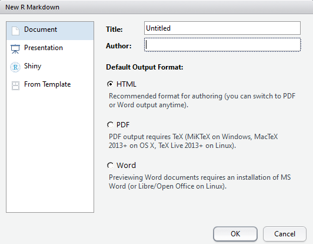
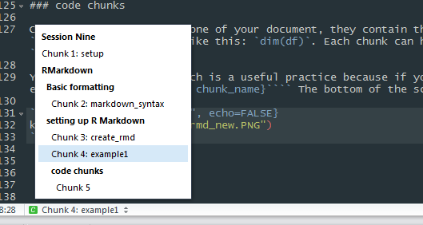
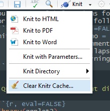
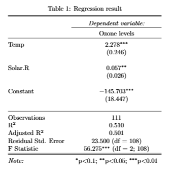

```{r setup, include=FALSE}
knitr::opts_chunk$set(echo = TRUE,
                      collapse = TRUE,
                      comment = "#>",
                      message = FALSE
)
```

> **Supplementary resources:**
>
> - [R Markdown: The Definitive Guide](https://bookdown.org/yihui/rmarkdown/),    
> - [R markdown cheat sheet](https://raw.githubusercontent.com/rstudio/cheatsheets/master/rmarkdown-2.0.pdf),    
> - [R Markdown reference guide](https://rstudio.com/wp-content/uploads/2015/03/rmarkdown-reference.pdf)
> - [The visual RMarkdown editor (zotero integration)](https://rstudio.github.io/visual-markdown-editing/#/)
> - [RStudio: Bibliographies and Citations](https://rmarkdown.rstudio.com/authoring_bibliographies_and_citations.html),    
> - [Yan Holtz: Pimp my RMD - a few tips for R Markdown](https://holtzy.github.io/Pimp-my-rmd/),   
> - [Kieran Healy: Plain text, papers, pandoc](https://kieranhealy.org/blog/archives/2014/01/23/plain-text/),     
> - [Create Awesome HTML Table with knitr::kable and kableExtra](https://cran.r-project.org/web/packages/kableExtra/vignettes/awesome_table_in_html.html)  


In this workshop the focus is on getting all the stuff out of R. We will cover how to create html (such as this), pdf (like a LaTeX document) or Word output from R, or how to get just individual results, such as regression tables. Communicating research is a fundamental part of the (academic) research process.

# RMarkdown

Markdown is a simple, easy to read and easy to write language that was created initially as a text-to-HTML tool. The Markdown syntax is straightforward and easy to memorize. Let's take a look at the basics.

## Basic formatting

Adding headers
```{r markdown_syntax}
# Header 1
## Header 2
### Header 3
#### Header 4
##### Header 5
###### Header 6
```


To add bold, italics or their combination:

```
*italics* or _italics_  
**bold** or __bold__  
```
*italics* or _italics_  
**bold** or __bold__  

Add linebreaks with two empty spaces + enter. A single enter just adds a newline.
  
Create lists easily:

```
unordered list

- item1
- item2
    + subitem1
    + subitem2
    
or

* item1
* item2
    + subitem1
    + subitem2


ordered lists

1. first item
2. second item
    2.1 subitem
    2.2 subitem

```
nordered list

- item1
- item2
    + subitem1
    + subitem2
    
or

* item1
* item2
    + subitem1
    + subitem2


ordered lists

1. first item
2. second item
    + sub item


Add images:
``


## Setting up R Markdown[^1]

[^1]: Examples for this section are adapted from the [R for Data Science, ch.27](http://r4ds.had.co.nz/r-markdown.html)

You can create a new R Markdown document from the `File > New File > R Markdown...` route. The new document you'll have is essentially a plain text file, with an `.Rmd` extension. R Markdown allows us to interweave text, code and results in one document. 

The main elements of our document are:

1. The YAML header at the beggining of the doc, between the `---` lines.
2. Code chunks, marked by ```` ``` ````
3. Text with markdown formatting

Knitting works that your `.Rmd` file is being sent to the `knitr` package, which then executes all your code chunks and then `pandoc` renders the output in your desired format.

```{r create_rmd, out.width = "400px", echo=FALSE}

```

A short document looks like this. We will go over each element and then use our previous sessions to write a short mock report.
```{r example1, echo=FALSE}
cat(htmltools::includeText("rmd_example/ex1.rmd"))
```


> **Quick exercise:** create a new R Markdown document and see what the output of the above code is. You can run the Rmarkdown document by "knitting" it with the Knit button.

### Chunk names

Code chunks are the backbone of your document, they contain the R code that you would write in your script. You can also embed code inline, with ```` ` ` ````, which will look like this: `dim(df)`. Each chunk can have different options, which you can specify in the top of the chunk like this: ```` ```{r, options here} ````   

You can also name your chunks by adding the name on the top: ```` ```{r chunk_name}````. It is a useful practice because if you have a chunk with some error in it, you know where to look for, after checking the error message.  The bottom of the script window also allows you to navigate between chunk by using their names.

```{r, out.width = "400px", echo=FALSE}

```


### Chunk options

You can specify options for each chunk (or set up a global default) which will controll how `knitr` will run the code inside. The most useful options:  

- `eval = TRUE/FALSE` When `FALSE` it'll only display code, not the output, as the code inside the chunk will not be evaluated and run. If you just want to show your code, without the results this is useful. 

- `echo = TRUE/FALSE` When `TRUE` it will show both your code and the output below.  

- `warning` and `error` when `TRUE` will display the error and warning messages alongside your results. Useful if you have long warnings for some reasons and you do not want to clutter the results.  

- `message` same as the previous, but with messages. (e.g.: what you see after loading packages)  

You can set global options for your document  with the following line in a code chunk: `knitr::opts_chunk$set()`. For example the defaults that I used for these outputs is the following:
```{r, include=TRUE, eval=FALSE}
knitr::opts_chunk$set(echo = TRUE,
                      comment = NA,
                      collapse = TRUE,
                      warning = FALSE)
```


### YAML header

In this, you can specify the attributes for your documents (similary to the LaTeX preambulum). 

The YAML header for this document looks like this:

````

---
title: "Working with RMarkdown"
author: "Akos Mate"
subtitle: "Session Eight"
date: '2020 July'
output:
    html_document:
        code_folding: "show"
        number_sections: TRUE
        toc: true
        toc_depth: 4
        toc_float: true
        theme: flatly
        highlight: tango
        css: ../rmd_style.css
bibliography: mybib.bib
---


````

Most of the things are self explanatory (such as title, author, etc.), but there are some options under `output` that are worth exploring. You should also mind the indentation of the header elements, because it matters!

The `output:` in this case is a `html_document`, with table of contents enables (`toc: true`) with displaying 3 levels (`toc_depth: 3`). The table of content automatically pulls your markdown headers (`#`, `##`, etc.). You can switch between outputs in two ways:  

* use the `output: pdf_document` in the YAML header  
* use the knit drop down menu to choose your output


```{r, out.width = "250px", echo=FALSE}

```

Possible output options are:  

* `pdf_document` creates a pdf doc, using LaTeX. If you always wanted to try LaTeX but found it too complicated, this is an easy way to create professional looking papers, without going into the LaTeX nitty-gritties (eventually you'll have to, I'm afraid).  
* `word_document` creates Microsoft Word docs with `.docx` extension
* `odt_document` creates OpenDocument Texts with `.odt` extension
* `rtf_document` creates Rich Text Format with `.rtf` extension


The `bibliography` is one of the key argument if you are writing academic papers. For this to work, you'll need a BibTeX file (with `.bib` extension), which is essentially a plain text file with your bib citation. If you use **(you should!!!!)** any citation manager, there is an option to export your citations into a `.bib` file. A bibtex formatted citation looks like this:

```
@article{albrecht1999time,
  title={Time varying speed of light as a solution to cosmological puzzles},
  author={Albrecht, Andreas and Magueijo, Joao},
  journal={Physical Review D},
  volume={59},
  number={4},
  pages={043516},
  year={1999},
  publisher={APS}
}
```

You can get this type of citation from Google Scholar as well. After you prepared your `.bib` file, you just need to specify it in the YAML header as such: `bibliography: mybib.bib`. 

> Important new development in RStudio 1.4 + is the Visual Markdown Editor which now includes a great Zotero support: https://rstudio.github.io/visual-markdown-editing/#/

* To insert the citation into the paper, you need to use the following syntax: `[@bibkey]` where the bib key is the identifier in the `@article{bibkey, ...}`. In our case, it is "albrecht1999time".   
* To cite this seminal contribution to science, we type: `[@albrecht1999time]` which will give us this: [@albrecht1999time].   
* For in text citation, just use `@albrecht1999time`: @albrecht1999time  
* Suppress the author by adding a `-`: `[-@albrecht1999time]`: Albrecht et al [-@albrecht1999time] demonstrated, that because of physics!  

You can add the bibliography at the end of your paper with the `# Bibliography` header. With this we are mostly set to write great papers without exiting from our R workflow.

## Tables and other output

We will see how to get our R things into html, LaTeX, and Word.

### html

```{r, message=FALSE}
library(dplyr)
library(knitr)
library(kableExtra)
library(survey)
library(broom)
library(stargazer)
```


If you need to create html versions of your research (for your blog for example), best to use the `knitr::kable()` function. The code which generates nice tables. If you wish, you can add further nice little extras with the `kableExtra` package. Let's add stripes to our table and highlight the row where our mouse is with the `kable_styling()` function. If left empty, it will give you a the output of the `kable()` function.

```{r}
df <- mtcars[1:5, 1:6]

```

```{r}
df %>%
  kable() %>%
  kable_styling()
```

The more fancy version:

```{r}
kable(df) %>%
  kable_styling(bootstrap_options = c("striped", "hover"))
```


You can export your regression tables in similar fashion after tidying it up with the `broom` package.

```{r}
data("airquality")

m1 <- tidy(lm(Ozone~Temp+Solar.R, data = airquality))

reg1_table <- m1 %>% 
    select(IV = term, Est. = estimate, sd = std.error, `p value` = p.value) %>% 
    mutate_if(is.numeric, funs(round(., 2)))
```

```{r}
reg1_table %>% 
    kable() %>% 
    kable_styling()
```

  
<br>  

<br>  

  

Or using the `stargazer` package, which is producing a more journal like output.

```{r}
m2 <- lm(Ozone~Temp+Solar.R, data = airquality)
```

```{r, results = "asis"}
stargazer(m2, title = "Regression result", dep.var.labels = "Ozone levels", type = "html")
```
  
<br>  

<br>  

  
To have the output render, you need to set your chunk options the following: ```` ```{r, results = "asis"} ````. Otherwise you'll just get the html code, that you can paste into any html file to have it rendered:

```{r}
stargazer(m2, title = "Regression result", dep.var.labels = "Ozone levels", type = "html")
```


### Word

There are a number of ways to export to Word. You can just simply use `kable()` and knit to Word, which will give you a table output in Word that you can format any way you like. Another option is you export the R table as a csv and then import it into Word by opening the csv file, then selecting the imported text, `Insert > Table > Convert Text to Table` and here Word should automatically recognize what it should do. 

```{r eval=FALSE}
write.table(reg1_table, file = "reg1_table.csv", sep = ",")
```

Otherwise, you can open the .csv in Excel and then copy the Excel table into Word.

### LaTeX

If you write in LaTeX, or knit the R markdown doc into pdf, you need LaTeX table output. Fortunately, the `stargazer` package is rather flexible in that regard, as you only have to specify `type = latex` to get the LaTeX output.

```{r}
stargazer(m2, title = "Regression result", dep.var.labels = "Ozone levels", type = "latex")
```

I highly suggest that you give the pdf output a go, or give LaTeX a try, as it produces beautiful, highly customizable and professional output. The output of the above code looks like this:  
  
  
```{r, out.width = "300px", echo=FALSE}

```

An alternative package for both the html and LaTeX output is `xtable`, which have similar functionality as `stargazer`.


# Example document with various R output

A quick example of what a possible article written in RMarkdown looks like is here: [https://github.com/aakosm/R_Basics_ECPR/blob/master/08_rmarkdown/rmd_example/ex2.pdf](https://github.com/aakosm/R_Basics_ECPR/blob/master/08_rmarkdown/rmd_example/ex2.pdf) 

The example article is based on the post of [Kieran Healy: Plain text, papers, pandoc](https://kieranhealy.org/blog/archives/2014/01/23/plain-text/) (click if you
want to dig deeper).

For a great and accessible guide on how RStudio (1.4.+) integrates with **Zotero** read this excellent blog post: https://blog.rstudio.com/2020/11/09/rstudio-1-4-preview-citations/  

For the visual RMarkdown editor, see this blogpost: https://blog.rstudio.com/2020/09/30/rstudio-v1-4-preview-visual-markdown-editing/


The source for that document is in the zip file you downloaded from Canvas  ("/rmd_example/ex2.rmd"), but for posterity, here is the rmd source (note: you will need the mybib.bib for it to run, which is also in the same folder).
```{r example2, echo=FALSE}
cat(htmltools::includeText("rmd_example/ex2.rmd"))
```


# Bibliography


